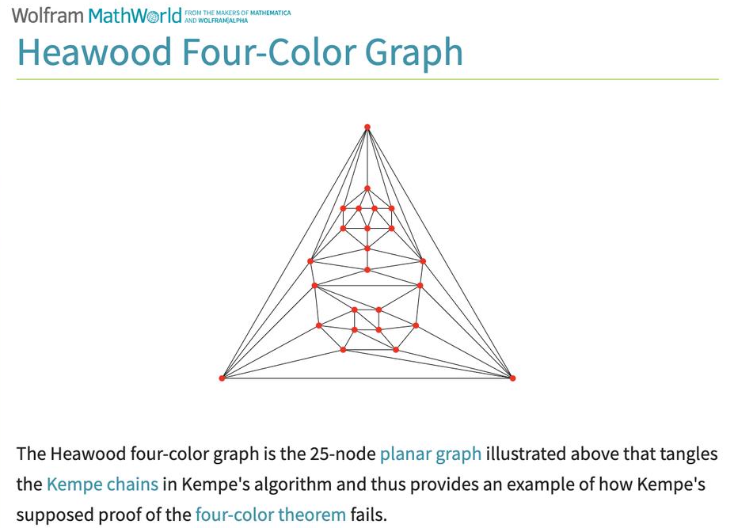
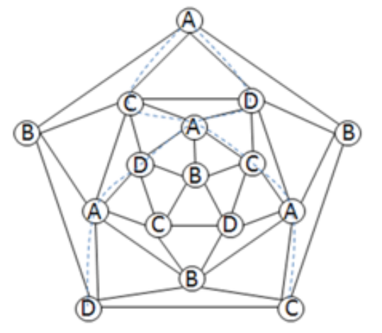

# 反例集

## 希伍德反例与GLFHO的发现

### 反例 1：25节点的希伍德四色图——Kempe 方法失效的原始案例（Heawood, 1890）

**历史背景**：
- Kempe 在 1879 年声称证明了四色定理
- Heawood 在 1890 年指出了关键缺陷
- 缺陷涉及5-度顶点处两条 Kempe 链的"缠绕"现象

**缺陷所在**：
在 Kempe 的论证中，对于5-度顶点 v（着色为5，邻居着色为 1,2,3,4,2），他断言：

> "总可以对某条 Kempe 链进行交换，使得 v 的五个邻居颜色简化到3种，从而 v 可以重新着色。"

这个断言忽视了一个关键事实：**两条 Kempe 链可能相互缠绕**，阻断了交换操作。

Heawood 构造了一个25节点的平面图（即希伍德四色图）来具体展示这一缺陷：



**节点数和结构**：
- 总共 25 个顶点
- 组织成三角形层叠结构
- 在其中某个5-度顶点处，形成了 GLFHO

**关键特征**：
```
         中心顶点 v (颜色5)
        /    |    \    |    \
      u₁    u₂    u₃   u₄    u₅
     (1)    (2)    (3)  (4)    (2)
```

- (1,3)-Kempe 链包含 u₁ 和 u₃，它们与路径 u₁→v→u₃ 构成 Jordan 闭曲线 Γ，将 u₂ 和 u₄ 分隔在 Γ 的两侧（颜色分隔引理：{2,4} ∩ {1,3,5} = ∅，(2,4)-链无法穿越 Γ）。
- u₂(2) 与 u₄(4) 被 Γ 隔离，在不同的 (2,4)-Kempe 链中——这正是 GLFHO 的充要条件。
- 结果：任何单次 Kempe 交换都无法为 v 腾出空位，因为对 (1,3)-链的交换保持 Γ 存在，对 (2,4)-链任一侧的交换只能改变一侧颜色，另一侧仍阻挡 v 的着色

**为什么是反例**：
- 该图本质上无需5种颜色着色，但无法通过 Kempe 链变换方式达成4色足够
- Kempe 的论证声称总可以通过链交换将5-着色简化为4-着色
- 矛盾的根源就是忽视了缠绕现象——链交换之间会相互干扰

---

## 经典反例的简化变体

### 反例 2：17节点的经典反例

这是最经典的希伍德反例简化版本，其特殊之处在于：对该图执行 Kempe 链变换会陷入着色循环——反复变换后颜色配置回到起点，始终无法突破困境。



**结构特点**：
- 使用"拓扑反转"视角：外围面被看作待着色的第17个顶点 v₀
- v₀ 与外五边形的5个顶点相邻，这5个顶点着色为 A, B, C, D, B
- 两条相互缠绕的 Kempe 链（虚线标注）阻断了重着色路径

**图的示意**：
```
         外围有界面（视为 v₀）
              |
        ┌─────┼─────┐
        │     │     │
       A(v₁) B(v₂) C(v₃)
        │     │     │
        D(v₄) B(v₅)
        └─────┼─────┘
              |
        Kempe链1 (A-C)
        Kempe链2 (A-D)
     相互缠绕的结构
```

**为什么是反例**：
- 该图本质上无需5种颜色着色，但 Kempe 链变换会陷入着色循环
- 将外围面视为一个顶点，与外五边形的5个顶点都相邻
- 这5个顶点占用了 A, B, C, D 四色（B 出现两次）
- 对 (A,C)-Kempe 链执行交换后，再尝试 (A,D)-Kempe 链交换，颜色配置又回到起点
- 这种"循环陷阱"正是 GLFHO 的典型表现

---

### 反例 3：9节点的极简反例（叶凤常, 1999）

这是1999年叶凤常在《贵州科学》中刊记的简化版本反例，也是已知的最小 GLFHO 构造：


**构造方法**：
- 9个顶点：一个中心顶点 w + 5个邻接顶点 u₁,...,u₅ + 额外的"外围"结构
- 中心顶点 w 着色为 5
- 5个邻接顶点着色为 A, B, C, D, B（循环排列）

**拓扑反转视角**：
```
        w(5) 在中心
       / | \ | \
      A  B  C  D  B
      |        |   |
    外围面视为一个待着色顶点
```

**为什么是极简反例**：
- 仅需9个节点（比17个更少）
- 仍然呈现出完整的 GLFHO 结构
- 两条 Kempe 链（A-C 和 A-D）以"纠缠"的方式出现
- 与17节点反例不同：连续多次执行 Kempe 链变换后可以达成4-着色，但单次变换无法直接解决
- 是研究 GLFHO 最小化实例的好材料

---

## 反例的共同特征

### 特征分析

所有这些反例都遵循同一个模式：

1. **必有一个5-度顶点** 中心顶点 w，着色使用颜色 e
2. **邻居的颜色分布** w 的5个邻居使用恰好4种颜色，其中一种出现两次
3. **两条缠绕的 Kempe 链**
   - 第一条：连接使用颜色对 {a,b} 的两个邻居
   - 第二条：连接使用颜色对 {c,d} 的两个邻居
   - 这两条链不是相互分离，而是形成"拓扑障碍"

4. **Jordan 曲线的分隔性**
   - 第一条 Kempe 链与经 w 的通路构成 Jordan 曲线
   - 这条曲线将第二条 Kempe 链的两个端点分隔到两侧
   - 结果：无法通过 Kempe 交换来改变两端点之间的颜色关系

---

## 反例对证明方法的启示

### 对 Kempe 的启示

希伍德反例表明：
- Kempe 链交换虽然强大，但并非万能
- 在5-度顶点处理上，需要考虑链之间的拓扑关系
- 简单的链交换可能被"缠绕"阻断

### 对本文方法的启示

本文通过反例得到的洞察：

1. **GLFHO 的本质** 不是单个顶点的着色困难，而是 Kempe 链的拓扑缠绕
2. **消除 GLFHO 的必要性** 必须针对这种缠绕结构采取特殊措施
3. **全局构造的必要性** 不能仅依赖局部的链交换，需要全局的拼接和对称性
4. **唯一性的重要性** 如果能证明最多只有一个 GLFHO，就能通过定理二的操作消除它

---

## 反例的验证

### 计算机验证的关键步骤

对每个反例，可以通过程序验证以下几点：

1. **着色的有效性**
   ```
   对每条边 (u,v)，检查 φ(u) ≠ φ(v)
   ```

2. **Kempe 链的构造**
   ```
   对于颜色对 {a,b}，找出所有颜色为 a 或 b 的顶点
   构建它们之间的连通分量
   ```

3. **Jordan 曲线的性质**
   ```
   验证 P（Kempe 路径）与 Q（中心通路）仅在端点相交
   检查分隔的顶点确实在曲线的两侧
   ```

4. **GLFHO 定义的满足**
   ```
   检查中心顶点的5个邻居使用4种颜色
   验证第一颜色对的两个顶点在同一 Kempe 链
   验证第二颜色对的两个顶点在不同 Kempe 链
   ```

---

## 反例的启发意义

虽然这些反例最初是用来**反驳 Kempe** 的，但在本文的证明框架中，它们起到了**构造性的作用**：

1. **定义 GLFHO 的样本** 这些反例是研究 GLFHO 结构的最佳教科书
2. **测试定理一** 在这些反例中寻找是否真的只有一个 GLFHO
3. **理解定理二的必要性** 这些反例中，对称拼接操作确实提供了突破缠绕的方法
4. **验证主定理** 主定理的证明必须能够处理包含这些反例结构的极小5-色图

