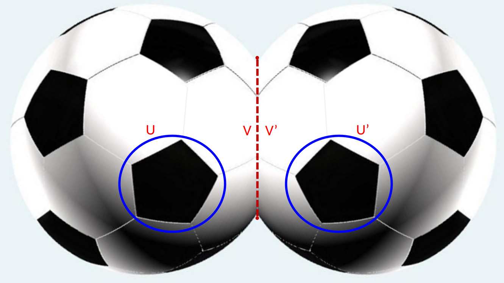

# 具体例子集

## Kempe 链的具体例子

### 例子 1：简单的 (1,3)-Kempe 链

**场景**：考虑一个简单平面图，顶点 v₁, v₂, ..., v₆ 排成一个环，着色为：
```
v₁(颜色1) - v₂(颜色2) - v₃(颜色3) - v₄(颜色1) - v₅(颜色4) - v₆(颜色2) - v₁
```

中间还有边 v₁-v₄，形成"之字形"路径。

**Kempe 链分析**：
- 颜色为 1 或 3 的顶点：v₁(1), v₃(3), v₄(1) 
- 这些顶点形成一个子图。检查连通性：
  - v₁ 和 v₃ 相邻吗？否（中间隔着 v₂）
  - v₁ 和 v₄ 直接相连（存在边）
  - v₃ 和 v₄ 相邻吗？否（中间隔着 v₅, v₆, v₁）
- 因此存在一条 (1,3)-Kempe 链：v₁ - [通过边 v₁-v₄] - v₄，这条链包含 v₁ 和 v₄
- 若要完整描述链，需要找出所有颜色为 1 或 3 的顶点及其 1 或 3 间的路径

**应用**：若我们对这条 (1,3)-Kempe 链进行颜色交换（1↔3），则：
```
v₁(3) - v₂(2) - v₃(1) - v₄(3) - v₅(4) - v₆(2) - v₁
```
仍然是有效的图着色。

---

## GLFHO 的具体构造

### 例子 2：最小的 GLFHO 构造（9节点极简例）

**图的构造**：
- 中心顶点 w（颜色5）
- w 的五个邻居 u₁, u₂, u₃, u₄, u₅，着色为 1, 2, 3, 4, 2（循环排列）
- 额外的顶点使得形成拓扑反转的结构

**关键结构**：
1. u₁(1) 和 u₃(3) 在同一条 (1,3)-Kempe 链上
2. u₂(2) 和 u₄(4) 在不同的 (2,4)-Kempe 链上
3. Jordan 曲线 Γ = P₁₃ ∪ Q（其中 P₁₃ 是 u₁ 到 u₃ 的 (1,3) 路径，Q 是 u₁→w→u₃ 的通路）分隔平面

**为什么是 GLFHO**：
- u₁(1) 与 u₃(3) 在同一 (1,3)-Kempe 链上，与路径 u₁→w→u₃ 构成 Jordan 闭曲线 Γ
- 由颜色分隔引理（{2,4} ∩ {1,3,5} = ∅），(2,4)-链无法穿越 Γ，故 u₂(2) 与 u₄(4) **必然**在不同的 (2,4)-Kempe 链中
- u 满足 GLFHO 定义的全部条件：任何单次 Kempe 交换均无法为 w 腾出可用颜色
- 反过来（命题3.1）：若 u₁u₃ 在**不同**链，则不形成 Γ，1步 1↔3 交换即可完成4-着色——这正是"非 GLFHO"的含义

---

### 例子 3：希伍德25节点反例中的 GLFHO

希伍德在1890年构造的反例包含以下关键要素：

**结构特点**：
- 25个顶点的平面图
- 某个5-度顶点 v，颜色为 5，邻居着色为 1,2,3,4,2
- 形成了Kempe链的复杂缠绕

**GLFHO 位置**：
- v 的邻域构成一个 GLFHO
- 两条关键的 Kempe 链在 v 周围形成"缠绕"结构
- 任何简单的 Kempe 交换都无法有效地为 v 补色

---

## 与5-度顶点的关系

### 例子 4：5-度顶点邻域中的 GLFHO

**构造**：
```
    u₁(1)
   /     \
u₅(2)    u₂(2)
  |   w(5)|
u₄(4)    u₃(3)
   \     /
```

- w 是5-度顶点，u₁u₂u₃u₄u₅ 是 w 的五个邻居（按环绕顺序排列）
- 这五个邻居构成 w 的邻域
- 这正是定理二转移操作的目标

**为什么5-度顶点特殊**：
- 5-度顶点邻域能够形成足够复杂的拓扑结构
- 但又不至于太复杂而无法处理
- 极小5-色图中必有至少12个5-度顶点（性质4.1.2）
- 其中必有两个互不相邻的5-度顶点（性质4.1.4），成为定理二操作中的"源"和"目标"

---

## 着色与不着色的边界

### 例子 5：4-着色 vs 5-着色

**可以4-着色的情况**：
```
w(1) - u₁(2) - u₂(3) - u₃(4) - u₄(1) - u₅(2) - w(1)
```
虽然 u₅ 的颜色与 w 相同，但在规范的图中，w 和 u₅ 之间没有边，这是合法的。
通过适当的重新着色，这个图总能用4种颜色着色。

**需要5-着色的情况**：
当上述结构中加入额外的边（如 u₁-u₃, u₂-u₄ 等），使得任意4个非 w 顶点两两相邻时，就形成了"Kempe 缠绕"的情况，可能需要第5种颜色。

---

## 对称拼接的直观理解

### 例子 6：拼接操作的简化模型

**第一步：手动增扩五边形面 v**：


上图示意了增扩操作：在 GLFHO 中心 u 的邻居 u₁ 另一侧，增扩一个新的五边形面 v，作为对称拼接的接口。因 u₁ 度数 ≥ 5，增扩必然可操作。

**第二步：对称拼接**：


上图示意了对称拼接操作：将增扩后的图 G⁺ 与其副本 G'⁺ 沿顶点 v/v' 的边界粘合，得到混合图 H。

**第三步：由定理一（唯一性）保证消解**：



应用定理一（GLFHO 唯一性），H 中至多只有一个 GLFHO。切开 H 后，存在两种情形：
- **情形 A**：若 v 为 GLFHO，则困难结构已从原位置 u 转移到新增的位置 v。约减 v 即得可4-着色的原图 G
- **情形 B**：若 v 不为 GLFHO，则原 u 顶点并非完全 GLFHO，通过多次 Kempe 链变换即可达成4-着色

**结论**：无论哪种情形，图 G 均可正常4-着色。

---

## 实验性质

这些例子可以通过计算机程序验证：
1. 检查 Kempe 链的连通性
2. 验证 Jordan 曲线的分隔性质
3. 确认 GLFHO 定义的所有条件
4. 模拟拼接和转移操作

### 示例演示：在9节点极简反例上检验(★1)-(★4)并执行局部交换

下列为对命题3.1中(★)条件的操作性检验流程，基于本文件上文介绍的 9 节点极简反例：

步骤 1（构造 Γ）：在已有的 5-着色 φ 下，确定第一颜色对 (a,b) 的 Kempe 链 P（连接 u₁ 与 u₃），以及通路 Q = u₁ → w → u₃，得到 Jordan 曲线 Γ = P ∪ Q；将图顶点按 Int(Γ)/Ext(Γ) 分类。

步骤 2（枚举候选颜色对 p,q）：在颜色集合 {1,2,3,4} 中枚举可能的 (p,q) 组合（通常优先选择那些出现在 Γ 内侧但不在 Γ 上的颜色对）。

步骤 3（查找连通分量 C）[检验(★1),(★2)]：在颜色子图 induced by {p,q} 中，查找所有连通分量，判断是否存在某个分量 C 满足 C ⊂ Int(Γ) 且 C ∩ V(Γ) = ∅。若无，则该 (p,q) 不可用，继续枚举。

步骤 4（链不穿墙检验）[检验(★3)]：对于每个候选分量 C，检查在颜色 r 或 s 的子图中是否存在路径从 C 通向 Γ 的对侧关键链（可通过 BFS/DFS 在颜色子图上搜索并检查是否需穿越 Γ）。若不存在，则满足(★3)。

步骤 5（交换收益检验）[检验(★4)]：模拟对 C 做 p↔q 交换，计算势函数 Φ（例如在局部邻域中第5色顶点计数）是否下降；若 Φ 下降，则该交换被接受并记录为有效下降步骤。

步骤 6（迭代归纳）：若 Φ 尚未为 0，重复步骤 2–5，直到 Φ=0（可为 u 赋色）。算法在有限状态空间中收敛。

实践中，在 9 节点极简反例上可以经常找到满足(★1)-(★4)的候选 C（例如某一侧的短链分量），通过若干次上述局部交换，能把局部第5色数减为0，从而为中心顶点 w 补色，达到 4-着色。

此演示旨在给出可执行的检验/操作流程，便于把理论命题转化为可编程的验证步骤。
