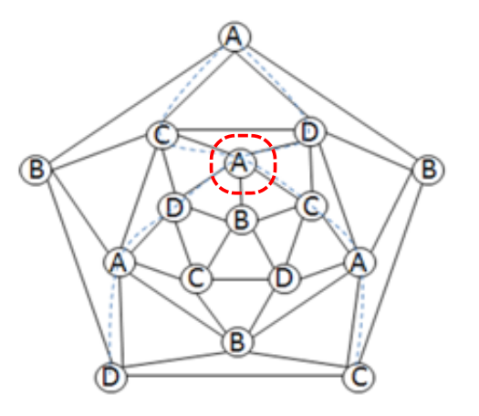
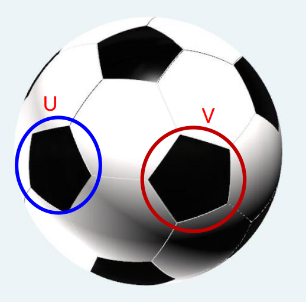

# 第三节　定理二：局部四色困难子图可在5-度顶点邻域间转移

定理二是证明路径中的关键一环，它说明"困难"是可以被搬运的。直观上：若某个5-度顶点邻域是个 GLFHO，我们可以把这个"麻烦"转移到另一个5-度顶点邻域，而原来的位置变得"不再麻烦"。

> **定理二：局部四色困难子图可在5-度顶点邻域间转移**
>
> 设 G 是极小5-色平面图，某5-度顶点 u 的邻域在着色 φ 下构成 GLFHO R，
> 且 G 中存在另一个5-度顶点 v 与 u 不相邻。
> 
> 则存在 G 的一个正常着色 φ'，使得以下至少之一成立：
> 
> **情形 A**：GLFHO 转移——困难结构可以通过对称拼接操作转移到另一个5-度顶点邻域（或被完全消除），使得原位置 u 的邻域不再构成 GLFHO。此时 G - {v} 可正常4-着色。
> 
> **情形 B**：非完全困难——原 u 处的 Kempe 链缠绕结构并非"不可打破的 GLFHO"，而是非完全 GLFHO。此时可通过有限次 Kempe 链变换使得 u 处达成4-着色。
> 
> 特别地，φ' 限制到 G - {v} 是一个正常4-着色。

## 3.1　证明思路：对称拼接与转移

以下是定理二的核心构造思路。

### 第一步：手动增扩一个五边形面 v

*图示：在 GLFHO 中心 u 的邻居 u₁ 另一侧，按图示增扩一个五边形面 v，作为对称拼接的接口。在满足 u₁ 度 ≥ 5 的局部嵌入与边界条件下，该增扩是可构造的。*

在极小5-色图 G 中，设 u 为 GLFHO 的中心5-度顶点。选取 u 的一个邻居 u₁（度数 ≥ 5），在 u₁ 远离 u 的一侧增扩一个新的五边形面，其中心顶点记为 v。增扩后的图记为 G⁺，v 是一个新的5-度顶点且与 u 不相邻。

### 第二步：对称拼接

将 G⁺ 复制一份得到 G'⁺，以5-度顶点 v（在 G⁺ 中）的边界为接口，将 G⁺ 和 G'⁺（通过 v' 的边界）粘合在一起，得到一个新的对称平面图 H。

*图示：将 G⁺ 与其副本 G'⁺ 沿顶点 v/v' 的边界进行对称拼接，得到混合图 H。*

在 H 中：
- G-侧包含原来的 GLFHO R（在 u 邻域）
- G'-侧包含 R' = R 的副本（在 u' 邻域）

### 第三步：通过对称性与子图论证导出结论

构造得到的 H 为 G⁺ 与其副本沿边界粘合而成的对称平面图。论证分两个层次展开：

**层次一：极小化着色论证（替代直接应用定理一）**

定理一的唯一性结论直接针对极小5-色图；H 本身未必是极小5-色图，故不能直接将定理一套用于 H。我们采用如下极小化论证：

在 H 的所有正常5-着色中，选取使"GLFHO 出现位置数"最少的一类着色 φ_H。若在 φ_H 下 H 两侧同时保有对称的 GLFHO（在 u 邻域与 u' 邻域各一），则可从 H 中提取出含两处 GLFHO 的极小5-色子图，与定理一在极小5-色子图上的唯一性结论矛盾。因此，在 φ_H 下 H 中至多一处 GLFHO，即 G-侧与 G'-侧**不能同时**是 GLFHO。

**层次二：子图关系——由"H 中非 GLFHO"推断"G-侧限制着色中非 GLFHO"**

注意 G（= G⁺-{v}）是 H 的子图。**G 中的任意 Kempe 链路径，在 φ_H 的限制着色 φ'_G = φ_H|_G 下同样是合法的 Kempe 链路径**（因 G ⊆ H，φ'_G 着色在 G 的边集上仍满足相邻顶点异色）。

由此得到关键推论：

> **子图引理**：若在 φ_H 下 u 在 H 中不构成 GLFHO（即 v₁ 与 v₃ 的 (1,3)-Kempe 链在 H 中不形成围绕 u 的 Jordan 障碍），则在限制着色 φ'_G 下，u 在 G 中同样不构成 GLFHO。
>
> **证明**：反设 u 在 G 的 φ'_G 下是 GLFHO，则 v₁ 与 v₃ 在 G 中通过 φ'_G 的 (1,3)-Kempe 链连接并形成 Jordan 曲线。由于 G ⊆ H 且 φ'_G = φ_H|_G，该 Kempe 路径也存在于 H 中，故 u 在 H 的 φ_H 下也是 GLFHO——矛盾。□

基于两个层次的结论，继续讨论两类情形：

**情形 A（转移）**：若在 φ_H 下增扩的顶点 v 成为 GLFHO 中心，则困难结构已转移到人工增扩的位置。约减 v 即可直接得到原图 G（= G⁺-{v}）的4-着色，与 χ(G) = 5 矛盾。

**情形 B（非完全 GLFHO / 消解）**：若在 φ_H 下 v 并非 GLFHO，则由层次一（两侧不能同时是 GLFHO）知 u 在 φ_H 下也不是 GLFHO，再由子图引理知 u 在 G 的限制着色 φ'_G 下也不是 GLFHO。情形 B 的完整逻辑链如下：

1. **u 在 φ'_G 下非 GLFHO**：v₁ 与 v₃ 的 (1,3)-Kempe 链，或 v₂ 与 v₄ 的 (2,4)-Kempe 链，在 φ'_G 下不形成围绕 u 的 Jordan 障碍。

2. **原始 Kempe 论证适用**：GLFHO 的定义正是 Kempe 交换失效的根本障碍——当 u 非 GLFHO 时，障碍不存在，1步 Kempe 链交换即可完成4-着色（命题 3.1）。

3. **矛盾**：G 的正常4-着色与假设 χ(G) = 5 矛盾，完成反证。

> **注：命题 3.1 的核心论点**　"u 非 GLFHO → v₁v₃ 在不同 (1,3)-链"（反证：若同链则由 Jordan 曲线 + 颜色分隔引理强制 v₂v₄ 分隔，使 u 成为 GLFHO，矛盾）。故非 GLFHO 时原始 Kempe 的1步论证严格成立，无待细化之处。

### 3.1b 有限 Kempe 可达性命题

**命题 3.1（有限 Kempe 可达性）**

设 G 为极小5-色平面图，φ 为 G 的正常5-着色，u 为一个5-度顶点，φ(u) = 5，其邻居按平面嵌入循环序为 v₁,v₂,v₃,v₄,v₅，φ(v₁)=1, φ(v₂)=2, φ(v₃)=3, φ(v₄)=4, φ(v₅)=2（重复色出现在 v₂,v₅ 两处，其他邻居色对称地可通过颜色置换归约到此情形）。若 u 在 φ 下**不构成 GLFHO**，则存在**1 步** Kempe 链交换，将 φ 变换为允许 u 被4-着色的配置，从而得到 G 的正常4-着色。

**证明**：

**关键论证：v₁ 与 v₃ 必定在不同的 (1,3)-Kempe 链中。**

反设 v₁ 与 v₃ 在同一 (1,3)-Kempe 链中。则存在 Kempe 链路径 P₁₃ 连接 v₁ 与 v₃，与路径 Q = v₁→u→v₃（经中心顶点 u）一起构成 Jordan 闭曲线 Γ = P₁₃ ∪ Q（引理 3.1）。

在 u 的平面嵌入中，邻居的循环序为 v₁,v₂,v₃,v₄,v₅。路径 Q 从 v₁ 经 u 到 v₃，在 u 处将邻居"切割"为两组：
- **内弧**（v₁ 到 v₃ 的短弧，经过 v₂）：v₂ 在 Γ 的内侧，即 v₂ ∈ Int(Γ)
- **外弧**（v₃ 到 v₁ 的长弧，经过 v₄,v₅）：v₄,v₅ 在 Γ 的外侧，即 v₄ ∈ Ext(Γ)

（上述"内外"划分基于平面嵌入中 u 邻居的循环顺序，对任何满足所设条件的平面嵌入均成立。）

现在，颜色集 {2,4}（v₂ 和 v₄ 的颜色）与 Γ 上的颜色集 {1,3}（P₁₃ 上）及 {5}（Q 经 u 的颜色）不相交，即 {2,4} ∩ {1,3,5} = ∅。由**引理 3.2（颜色分隔引理）**：(2,4)-Kempe 链不能从 Int(Γ) 穿越到 Ext(Γ)。

因此 v₂（在 Int(Γ)）与 v₄（在 Ext(Γ)）**不在同一 (2,4)-Kempe 链中**，这正是 GLFHO 定义条件 (iv) 所要求的。结合已有的 v₁v₃ 同链（条件 (ii)）和颜色配置（条件 (i)），u 处满足 GLFHO 的全部条件，即 u **是 GLFHO**——与"u 非 GLFHO"的假设矛盾。

**因此**，v₁ 与 v₃ 必定在不同的 (1,3)-Kempe 链中。□

**完成4-着色**：对含 v₁ 的 (1,3)-Kempe 链做 1↔3 颜色交换：
- 该链不含 v₃（v₁v₃ 在不同链），故 v₃ 颜色不受影响（v₃ 保持颜色 3）
- 交换后：v₁ 的颜色 1→3，u 的邻域颜色变为 {3,2,3,4,2} = {2,3,4}
- 颜色 1 不再出现于 u 的邻域，u 可取色 1，得到 G 的正常4-着色

**1 步 Kempe 交换完成，G 有正常4-着色，与 χ(G) = 5 矛盾。** □

> **注**：上述论证将"u 非 GLFHO"与"v₁v₃ 在不同 (1,3)-链"等价对应（在特定颜色配置下），揭示了 GLFHO 定义的深层拓扑含义：GLFHO 恰好是 Jordan 曲线 + 颜色分隔引理共同强制的不可绕过的结构。非 GLFHO 时，原始 Kempe 的1步论证可正常运转。命题的其他颜色配置（重复色在不同位置）可通过循环置换和颜色置换对称地归约到此情形。

### 第四步：结论

综合以上构造：在极小化着色选择下，增扩的 v 顶点要么成为 GLFHO（情形 A），要么 u 在 G 的限制着色 φ'_G 下非 GLFHO（情形 B，由子图引理保证，命题 3.1 说明此时可完成4-着色）。两种情形均导出矛盾。这正是定理二所要证明的结论。  □

## 3.2　定理二的作用：消解 GLFHO

定理二的核心价值在于：它提供了一种不依赖 Kempe 链交换的方法，将 G - {v} 从"含 GLFHO 的5-着色"转化为"无 GLFHO 的4-着色"。

在四色定理的主证明（第四节）中，定理二被如下使用：

1. **消解**：对极小5-色图 G 中的 GLFHO 中心 u 和另一个5-度顶点 v，通过对称拼接构造得到 G - {v} 的正常4-着色 φ'，且 φ' 下 u 处无 GLFHO。

2. **扩展**：从 G - {v} 的4-着色 φ' 扩展到 G 的4-着色。由于 v 是按需人工扩增的接口顶点，且 v 的5个邻居在 φ' 下至多使用4种颜色（v 在 φ' 下本身未参与着色），可直接为 v 赋一种邻域未使用的颜色。

这个构造的关键特征在于：它**不依赖于追踪 Kempe 链的中间状态**，通过对称拼接的设计保证了 u 处 GLFHO 的消解。

## 3.2b　备注：v 点角色与两种情形的深入说明

v 在本证明中是**按需人工扩增**的辅助顶点——它被引入的目的是提供对称拼接的接口，而非 G 中固有的结构性障碍。

**情形 A 的含义**：当增扩的 v 成为 GLFHO 中心时，困难结构已从原位置 u 转移到新增的位置 v。由于 v 是人工扩增的，约减 v 即得原图 G 的4-着色。

**情形 B 的含义——"非完全 GLFHO"的机制**：当增扩的 v 不成为 GLFHO 中心时，u 在 H 的极小化着色下也不是 GLFHO。核心机制分两步：

1. **对称性消解（为何 u 在 H 中非 GLFHO）**：
   - 由极小化着色论证（见第三步层次一），H 中至多一处 GLFHO
   - 若 u 是 GLFHO，由 H 的对称性，u' 也是 GLFHO，产生两处 GLFHO，矛盾
   - 故在 φ_H 下，u 不是 GLFHO

2. **子图推断（为何 u 在 G 的限制着色中也非 GLFHO）**：
   - G 是 H 的子图：G 中的 Kempe 链路径也是 H 中的 Kempe 链路径
   - 若 u 在 G 的限制着色 φ'_G 下是 GLFHO，则同一 Kempe 路径也使 u 在 H 中是 GLFHO——矛盾
   - 故 u 在 φ'_G 下非 GLFHO（详见第三步"子图引理"）

3. **Kempe 论证适用（为何非 GLFHO 意味着可 4-着色）**：
   - GLFHO 的定义正是 Kempe 交换失效的结构性障碍
   - u 非 GLFHO → 障碍不存在 → Kempe 交换在 G 中对 u 可正常运转
   - 有限步 Kempe 变换后，u 可被4色着色，G 有正常4-着色，矛盾
   - 这与9节点极简反例（叶凤常，1999）平行：初始着色有 GLFHO 表象，但该 GLFHO 属于"非完全型"，连续 Kempe 变换后可达成4-着色

**总结**：情形 A 与情形 B 均导出 χ(G) ≤ 4，与 χ(G) = 5 的假设矛盾。两条路径的本质区别在于：情形 A 通过"转移"消解 GLFHO（直接4-着色），情形 B 通过"子图推断 + 原始 Kempe 论证"消解 GLFHO（间接4-着色）。

## 3.3　定理二的前提条件

定理二依赖以下关键性质：

1. **极小性**（Minimality）：G 是极小5-色图，保证 G - {任意顶点} 可4-着色，为下文约减 v 提供基础。

2. **v 与 u 不相邻**：v 由增扩构造产生，位于 u 邻居的另一侧，天然满足不相邻条件，保证对称拼接后 u 的局部邻域结构不受 v 的粘合操作影响。

3. **唯一性与极小化**（定理一的间接应用）：通过对极小化着色的选择，在极小5-色子图上应用定理一的唯一性，间接保证 H 中 G-侧与 G'-侧不能同时是 GLFHO。

## 3.4　与 Kempe 链交换的关系

定理二的核心步骤（情形 A）**不依赖于 Kempe 链交换**——这是与 Kempe 1879年方法的根本区别。

Kempe 的错误在于假设两条 Kempe 链可以安全地交换，而没有考虑它们可能相互缠绕的情况（即 GLFHO）。

定理二通过**对称拼接**与**定理一的唯一性保证**来回避这个困难，用一个"整体的全局构造"替代了"局部的链交换操作"。而情形 B 中的多次 Kempe 链变换之所以可行，是因为原 u 顶点的缠绕结构并非完全 GLFHO，不存在不可打破的阻塞。
